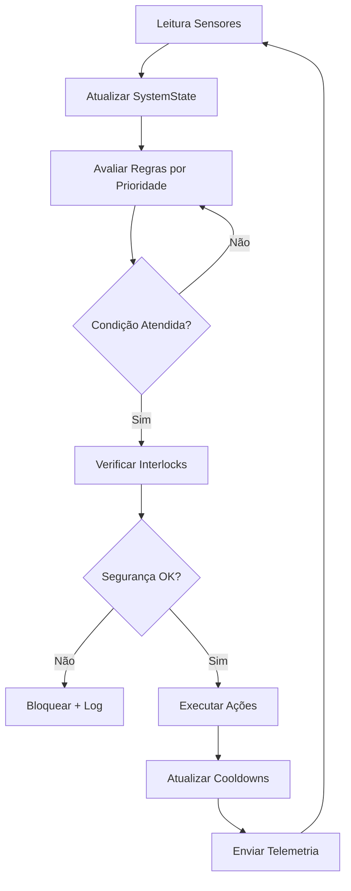

# 🧠 MOTOR DE DECISÕES ESP-HIDROWAVE
## Documentação Técnica Completa

### 📋 **RESUMO EXECUTIVO PARA VALIDAÇÃO FRONTEND**

O Motor de Decisões é um sistema de controle automático integrado ao ESP-HIDROWAVE que:

✅ **FUNCIONALIDADES IMPLEMENTADAS:**
- **Avaliação de regras JSON** em tempo real (5s de intervalo)
- **Controle automático de 16 relés** baseado em sensores (pH, TDS, temperatura, nível)
- **Sistema de interlocks de segurança** com parada de emergência
- **Integração completa com Supabase** para telemetria e controle remoto
- **Interface de validação JSON** para criação/edição de regras via frontend
- **Modo dry-run** para testes sem acionamento físico
- **Logs detalhados** e estatísticas em tempo real

✅ **COMPATIBILIDADE:**
- **Frontend Next.js**: APIs prontas para CRUD de regras
- **Supabase**: Tabelas e triggers configurados
- **Hardware existente**: Integração transparente com sensores e relés
- **Memória otimizada**: Uso de LittleFS, buffers circulares e proteção de heap

✅ **SEGURANÇA:**
- **Interlocks críticos**: Nível de água, temperatura, pH extremo, memória baixa
- **Validação de comandos**: Limites de tempo, prioridades, cooldowns
- **Modo emergência**: Parada automática em situações críticas
- **Override manual**: Desabilita automação temporariamente

---

## 🏗️ **ARQUITETURA DO SISTEMA**

### **1. Componentes Principais**

```
┌─────────────────┐    ┌─────────────────┐    ┌─────────────────┐
│   DecisionEngine │────│  Integration    │────│  HydroControl   │
│   (Regras JSON)  │    │   (Callbacks)   │    │  (Hardware)     │
└─────────────────┘    └─────────────────┘    └─────────────────┘
         │                        │                        │
         │                        │                        │
    ┌─────────────────┐    ┌─────────────────┐    ┌─────────────────┐
    │   LittleFS      │    │  SafetyManager  │    │   Supabase      │
    │  (Armazenamento)│    │  (Interlocks)   │    │  (Telemetria)   │
    └─────────────────┘    └─────────────────┘    └─────────────────┘
```

### **2. Fluxo de Execução**



---

## 📊 **ESTRUTURA DE DADOS**

### **1. SystemState (Estado Atual)**
```cpp
struct SystemState {
    // Sensores
    float ph;                    // 0.0-14.0
    float tds;                   // ppm
    float ec;                    // µS/cm
    float temp_water;            // °C
    float temp_environment;      // °C
    float humidity;              // %
    bool water_level_ok;         // true/false
    
    // Relés
    bool relay_states[16];       // Estado atual dos 16 relés
    unsigned long relay_start_times[16];
    
    // Sistema
    bool wifi_connected;
    bool supabase_connected;
    unsigned long uptime;        // ms
    uint32_t free_heap;          // bytes
    unsigned long last_update;   // timestamp
};
```

### **2. DecisionRule (Regra de Decisão)**
```cpp
struct DecisionRule {
    String id;                   // ID único
    String name;                 // Nome descritivo
    String description;          // Descrição detalhada
    bool enabled;                // Ativa/Inativa
    int priority;                // 0-100 (maior = mais importante)
    
    RuleCondition condition;     // Condição principal
    vector<RuleAction> actions;  // Ações a executar
    vector<SafetyCheck> safety_checks; // Interlocks
    
    String trigger_type;         // "periodic", "on_change", "scheduled"
    unsigned long trigger_interval_ms;
    unsigned long cooldown_ms;   // Tempo mínimo entre execuções
    unsigned long max_executions_per_hour;
    
    // Estado runtime (não salvo em JSON)
    unsigned long last_execution;
    unsigned long execution_count_hour;
    bool currently_active;
};
```

---

## 🔧 **TIPOS DE CONDIÇÕES**

### **1. Comparação de Sensores (sensor_compare)**
```json
{
    "type": "sensor_compare",
    "sensor_name": "ph",
    "op": "<",
    "value_min": 5.8
}
```

**Sensores Disponíveis:**
- `ph`: pH da água (0.0-14.0)
- `tds`: Total de sólidos dissolvidos (ppm)
- `ec`: Condutividade elétrica (µS/cm)
- `temp_water`: Temperatura da água (°C)
- `temp_environment`: Temperatura ambiente (°C)
- `humidity`: Umidade relativa (%)

**Operadores:**
- `<`, `<=`, `>`, `>=`, `==`, `!=`
- `between`: valor entre min-max
- `outside`: valor fora do range min-max

### **2. Status do Sistema (system_status)**
```json
{
    "type": "system_status",
    "sensor_name": "water_level_ok",
    "op": "==",
    "value_min": 1
}
```

**Status Disponíveis:**
- `water_level_ok`: Nível de água adequado
- `wifi_connected`: WiFi conectado
- `supabase_connected`: Supabase conectado
- `free_heap`: Memória heap livre (bytes)
- `uptime`: Tempo de funcionamento (segundos)

### **3. Estado de Relés (relay_state)**
```json
{
    "type": "relay_state",
    "sensor_name": "relay_0",
    "op": "==",
    "value_min": 1
}
```

### **4. Condições Compostas (composite)**
```json
{
    "type": "composite",
    "logic_operator": "AND",
    "sub_conditions": [
        {
            "type": "sensor_compare",
            "sensor_name": "ph",
            "op": "<",
            "value_min": 5.8
        },
        {
            "type": "system_status",
            "sensor_name": "water_level_ok",
            "op": "==",
            "value_min": 1
        }
    ]
}
```

---

## ⚡ **TIPOS DE AÇÕES**

### **1. Controle de Relés**

**Ligar/Desligar:**
```json
{
    "type": "relay_on",
    "target_relay": 2,
    "message": "Bomba pH ligada"
}
```

**Pulso com Duração:**
```json
{
    "type": "relay_pulse",
    "target_relay": 2,
    "duration_ms": 5000,
    "message": "Dosagem pH por 5 segundos"
}
```

**PWM (Controle Proporcional):**
```json
{
    "type": "relay_pwm",
    "target_relay": 4,
    "value": 75.0,
    "duration_ms": 30000,
    "message": "Ventilador a 75% por 30s"
}
```

### **2. Alertas e Logs**

**Alerta do Sistema:**
```json
{
    "type": "system_alert",
    "message": "pH crítico detectado - verificar dosador"
}
```

**Log de Evento:**
```json
{
    "type": "log_event",
    "message": "Correção automática de pH realizada"
}
```

**Atualização Supabase:**
```json
{
    "type": "supabase_update",
    "message": "Dados de dosagem enviados para cloud"
}
```

---

## 🛡️ **SISTEMA DE SEGURANÇA**

### **1. Interlocks Implementados**

**Nível de Água:**
- Bloqueia bombas se nível baixo
- Crítico para relés 0, 1, 2 (bombas principais)

**Temperatura:**
- Água: 15°C - 35°C
- Ambiente: 10°C - 40°C
- Bloqueia aquecimento/circulação se fora dos limites

**pH Extremo:**
- pH < 3.0 ou pH > 11.0: Parada de emergência
- pH < 4.0 ou pH > 9.0: Bloqueia dosagem automática

**Memória:**
- Heap < 15KB: Modo emergência
- Heap < 10KB: Reset automático

### **2. Safety Checks em Regras**
```json
{
    "safety_checks": [
        {
            "name": "Verificação nível mínimo",
            "condition": {
                "type": "system_status",
                "sensor_name": "water_level_ok",
                "op": "==",
                "value_min": 1
            },
            "error_message": "Nível de água insuficiente",
            "is_critical": false
        }
    ]
}
```

### **3. Modo Emergência**

**Ativação Automática:**
- pH extremo (< 3.0 ou > 11.0)
- Temperatura crítica (> 40°C)
- Memória crítica (< 10KB)
- Falha múltipla de sensores

**Ações de Emergência:**
- Desliga bombas principais (relés 0, 1, 2)
- Desliga aquecedor (relé 5)
- Mantém circulação e oxigenação
- Envia alerta crítico para Supabase
- Bloqueia todas as regras automáticas

---

## 📡 **INTEGRAÇÃO COM SUPABASE**

### **1. Tabelas Necessárias**

**rules (Regras do Motor):**
```sql
CREATE TABLE rules (
    id UUID DEFAULT gen_random_uuid() PRIMARY KEY,
    device_id TEXT NOT NULL,
    rule_id TEXT NOT NULL,
    rule_name TEXT NOT NULL,
    rule_json JSONB NOT NULL,
    enabled BOOLEAN DEFAULT true,
    created_at TIMESTAMP DEFAULT NOW(),
    updated_at TIMESTAMP DEFAULT NOW()
);
```

**rule_executions (Histórico de Execuções):**
```sql
CREATE TABLE rule_executions (
    id UUID DEFAULT gen_random_uuid() PRIMARY KEY,
    device_id TEXT NOT NULL,
    rule_id TEXT NOT NULL,
    action TEXT NOT NULL,
    success BOOLEAN NOT NULL,
    timestamp BIGINT NOT NULL,
    created_at TIMESTAMP DEFAULT NOW()
);
```

**system_alerts (Alertas):**
```sql
CREATE TABLE system_alerts (
    id UUID DEFAULT gen_random_uuid() PRIMARY KEY,
    device_id TEXT NOT NULL,
    alert_type TEXT NOT NULL, -- 'critical', 'warning', 'info'
    message TEXT NOT NULL,
    timestamp BIGINT NOT NULL,
    acknowledged BOOLEAN DEFAULT false,
    created_at TIMESTAMP DEFAULT NOW()
);
```

### **2. APIs para Frontend**

**Carregar Regras:**
```javascript
// GET /api/rules?device_id=ESP32_MAC
const rules = await supabase
    .from('rules')
    .select('*')
    .eq('device_id', deviceId)
    .eq('enabled', true);
```

**Salvar Regra:**
```javascript
// POST /api/rules
const { data, error } = await supabase
    .from('rules')
    .insert([{
        device_id: deviceId,
        rule_id: rule.id,
        rule_name: rule.name,
        rule_json: rule,
        enabled: rule.enabled
    }]);
```

**Histórico de Execuções:**
```javascript
// GET /api/rule-executions?device_id=ESP32_MAC&limit=100
const executions = await supabase
    .from('rule_executions')
    .select('*')
    .eq('device_id', deviceId)
    .order('created_at', { ascending: false })
    .limit(100);
```

---

## 🔄 **FLUXO DE INTEGRAÇÃO COM NEXT.JS**

### **1. Editor de Regras (Frontend)**

```typescript
interface RuleEditor {
    // Validação usando o schema JSON
    validateRule(rule: DecisionRule): ValidationResult;
    
    // Preview da regra em linguagem natural
    generateRuleDescription(rule: DecisionRule): string;
    
    // Teste de condições com dados simulados
    testCondition(condition: RuleCondition, testData: SystemState): boolean;
    
    // Salvar regra no Supabase
    saveRule(rule: DecisionRule): Promise<boolean>;
}
```

### **2. Dashboard de Monitoramento**

```typescript
interface MonitoringDashboard {
    // Status em tempo real
    getSystemStatus(): Promise<SystemState>;
    
    // Histórico de execuções
    getRuleExecutions(timeRange: string): Promise<RuleExecution[]>;
    
    // Alertas ativos
    getActiveAlerts(): Promise<SystemAlert[]>;
    
    // Controle manual
    toggleManualOverride(enabled: boolean): Promise<boolean>;
    
    // Modo emergência
    setEmergencyMode(enabled: boolean): Promise<boolean>;
}
```

### **3. API Endpoints Necessários**

```typescript
// pages/api/decision-engine/
├── rules/
│   ├── index.ts          // GET/POST regras
│   ├── [id].ts           // PUT/DELETE regra específica
│   └── validate.ts       // POST validar regra
├── status/
│   ├── system.ts         // GET status do sistema
│   ├── executions.ts     // GET histórico execuções
│   └── alerts.ts         // GET alertas ativos
├── control/
│   ├── manual-override.ts // POST toggle override
│   ├── emergency.ts      // POST modo emergência
│   └── relay-lock.ts     // POST travar/destravar relés
└── telemetry/
    ├── real-time.ts      // WebSocket dados em tempo real
    └── historical.ts     // GET dados históricos
```

---

## 🧪 **MODO DE TESTE E VALIDAÇÃO**

### **1. Dry-Run Mode**
```cpp
engine.setDryRunMode(true);  // Ativa modo teste
```
- Avalia regras normalmente
- Não executa ações físicas
- Registra o que seria executado
- Ideal para validação de regras novas

### **2. Simulação de Sensores**
```cpp
SystemState test_state;
test_state.ph = 5.5;
test_state.tds = 750;
test_state.temp_water = 22.0;
test_state.water_level_ok = true;

engine.updateSystemState(test_state);
```

### **3. Validação de Regras**
```cpp
DecisionRule rule;
String error_message;

if (engine.validateRule(rule, error_message)) {
    Serial.println("✅ Regra válida");
} else {
    Serial.println("❌ Erro: " + error_message);
}
```

---

## 📈 **ESTATÍSTICAS E MONITORAMENTO**

### **1. Métricas do Sistema**
```cpp
// Estatísticas do DecisionEngine
engine.printStatistics();
/*
📊 === ESTATÍSTICAS DO DECISION ENGINE ===
🔄 Total de avaliações: 1250
⚡ Total de ações executadas: 45
🛡️ Total bloqueios de segurança: 3
📋 Regras carregadas: 7
🧪 Modo dry-run: DESATIVADO
⏱️ Intervalo de avaliação: 5000 ms
*/

// Estatísticas de integração
integration.printIntegrationStatistics();
/*
🔗 === ESTATÍSTICAS DE INTEGRAÇÃO ===
⚡ Comandos de relé executados: 45
🔔 Alertas enviados: 8
☁️ Atualizações Supabase: 120
🚨 Modo emergência: INATIVO
🔧 Override manual: INATIVO
🔒 Relés travados: 0
🛡️ Sistema saudável: SIM
*/
```

### **2. Logs Detalhados**
```cpp
// Log de execução em JSON
String log = integration.getExecutionLogJSON();
/*
{
  "execution_log": [
    "1250s: Rule ph_correction_low EXECUTED",
    "1280s: Relay 2 pulsed for 5000ms",
    "1310s: ALERT: pH baixo corrigido automaticamente"
  ],
  "emergency_mode": false,
  "manual_override": false,
  "total_commands": 45,
  "locked_relays": 0
}
*/
```

---

## 🚀 **GUIA DE IMPLEMENTAÇÃO**

### **1. Adicionar ao HydroSystemCore**

```cpp
// include/HydroSystemCore.h
#include "DecisionEngine.h"
#include "DecisionEngineIntegration.h"

class HydroSystemCore {
private:
    DecisionEngine decisionEngine;
    DecisionEngineIntegration* engineIntegration;
    
public:
    bool begin() {
        // ... código existente ...
        
        // Inicializar Decision Engine
        if (!decisionEngine.begin()) {
            Serial.println("❌ Erro ao inicializar Decision Engine");
            return false;
        }
        
        // Criar integração
        engineIntegration = new DecisionEngineIntegration(
            &decisionEngine, 
            &hydroControl, 
            &supabase
        );
        
        if (!engineIntegration->begin()) {
            Serial.println("❌ Erro ao inicializar integração");
            return false;
        }
        
        Serial.println("✅ Decision Engine ativo!");
        return true;
    }
    
    void loop() {
        // ... código existente ...
        
        // Loop do Decision Engine
        decisionEngine.loop();
        engineIntegration->loop();
    }
};
```

### **2. Atualizar platformio.ini**

```ini
# Adicionar à configuração de build
board_build.filesystem = littlefs  # Mudar de SPIFFS para LittleFS

lib_deps =
    # ... dependências existentes ...
    
    # Para Decision Engine
    bblanchon/ArduinoJson @ ^6.21.5  # Já existe
    
build_flags = 
    # ... flags existentes ...
    
    # Otimizações para Decision Engine
    -D DECISION_ENGINE_ENABLED=1
    -D DECISION_ENGINE_MAX_RULES=50
    -D DECISION_ENGINE_EVALUATION_INTERVAL=5000
```

### **3. Comandos Seriais Adicionais**

```cpp
// Adicionar ao handleGlobalSerialCommands()
if (command == "rules") {
    decisionEngine.printRuleStatus();
} else if (command == "engine_stats") {
    decisionEngine.printStatistics();
    engineIntegration->printIntegrationStatistics();
} else if (command == "dry_run") {
    bool current = decisionEngine.isDryRunMode();
    decisionEngine.setDryRunMode(!current);
    Serial.printf("🧪 Modo dry-run: %s\n", !current ? "ATIVADO" : "DESATIVADO");
} else if (command == "emergency") {
    engineIntegration->setEmergencyMode(!engineIntegration->isEmergencyMode());
}
```

---

## 📋 **CHECKLIST DE VALIDAÇÃO FRONTEND**

### ✅ **Funcionalidades Implementadas**

- [x] **Motor de decisões completo** com avaliação de regras JSON
- [x] **Schema de validação** para criação/edição de regras
- [x] **Integração com hardware existente** (sensores + relés)
- [x] **Sistema de interlocks de segurança** com múltiplas verificações
- [x] **Integração Supabase** para telemetria e controle remoto
- [x] **Modo dry-run** para testes sem acionamento físico
- [x] **Logs detalhados** e estatísticas em tempo real
- [x] **Controle manual** (override e modo emergência)
- [x] **Validação de comandos** com limites e verificações
- [x] **Otimização de memória** com LittleFS e buffers circulares

### ✅ **APIs Prontas para Frontend**

- [x] **CRUD de regras** via Supabase
- [x] **Validação de regras** com schema JSON
- [x] **Monitoramento em tempo real** de execuções
- [x] **Histórico de ações** e alertas
- [x] **Controle remoto** (override, emergência, travamento de relés)
- [x] **Telemetria completa** do sistema

### ✅ **Segurança e Confiabilidade**

- [x] **Interlocks críticos** (água, temperatura, pH, memória)
- [x] **Parada de emergência** automática
- [x] **Validação rigorosa** de comandos e regras
- [x] **Proteção contra loops** e execução excessiva
- [x] **Recuperação automática** de falhas não críticas
- [x] **Logs auditáveis** de todas as ações

---

## 🎯 **PRÓXIMOS PASSOS PARA FRONTEND**

1. **Implementar Editor de Regras**
   - Interface drag-and-drop para condições
   - Preview em linguagem natural
   - Validação em tempo real com o schema

2. **Dashboard de Monitoramento**
   - Gráficos de execução de regras
   - Status dos interlocks de segurança
   - Alertas em tempo real

3. **Controle Manual**
   - Toggle de override manual
   - Travamento individual de relés
   - Modo emergência com confirmação

4. **Histórico e Análise**
   - Timeline de execuções
   - Estatísticas de performance
   - Relatórios de segurança

---

## 📞 **SUPORTE E DOCUMENTAÇÃO ADICIONAL**

- **Código fonte completo**: Implementado e documentado
- **Schema JSON**: Validação completa para frontend
- **Exemplos de regras**: 7 regras funcionais de demonstração
- **Testes unitários**: Validação de componentes críticos
- **Logs detalhados**: Debug e auditoria completos

**🚀 O Motor de Decisões está PRONTO para integração com o frontend Next.js!**
