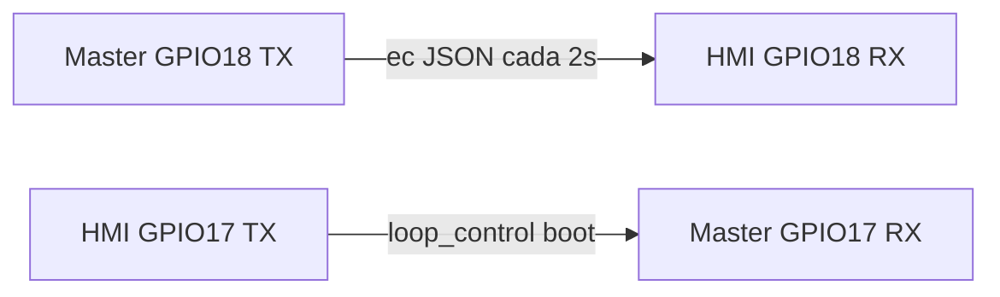

# UART_BRINGUP — Master ↔ HMI (bancada)

Documento vivo para cerrar el enlace físico UART entre **ESP-HIDROWAVE** (Master ESP32) y **HMI-INTERFACE** (JC3248W535 ESP32-S3).

Contrato JSON: [`HMI-INTERFACE-main/docs/HMI_UART.md`](../../HMI-INTERFACE-main/docs/HMI_UART.md).  
Bridge Master: [`HMI_BRIDGE.md`](HMI_BRIDGE.md).

---

## Estado

**EN CURSO** — `rx_bytes=0` bidireccional (2026-08-28).

| Lado | Evidencia |
|------|-----------|
| Master (COM5) | `[HMI UART TX] ec~190` cada ~2 s; `[HMI UART DBG] rx_bytes=0` |
| HMI (COM4) | `[UART TX] loop_control` al boot; `[UART DBG] rx_bytes=0` |

Firmware TX OK en ambos lados → fallo físico (cable/GND/pin) o pinout ESP32U mal interpretado.



---

## Cableado

| Señal | Master ESP32 | HMI ESP32-S3 (JC3248W535) |
|-------|--------------|---------------------------|
| TX    | GPIO **18**  | RX GPIO **18**            |
| RX    | GPIO **17**  | TX GPIO **17**            |
| GND   | GND          | GND                       |

- Baud **115200**, 8N1.
- **Trampa pinout:** en el diagrama de la placa ESP32U a veces aparece "UART2 TX" en IO17. En **firmware** IO17 = **RX** del Master y IO18 = **TX**. No cruzar por nombre del silkscreen.
- Referencia visual: [`data/pinout ESP32U.png`](../data/pinout%20ESP32U.png)

Cable cruzado obligatorio:

```
HMI TX (17) ──► Master RX (17)
Master TX (18) ──► HMI RX (18)
GND ──────────── GND común
```

---

## Build bancada

Usar envs **bring-up** (no prod):

| Proyecto | Comando | Env |
|----------|---------|-----|
| Master | `pio run -e esp32dev-bringup` | `UART_BRINGUP=1`, `UART_LINK_DEBUG=1` |
| HMI | `pio run -e esp32-s3-hmi-bringup` | idem |

Master adicional:

- Platform: `espressif32 @ 6.4.0`
- `jobs = 1`
- `build_dir = C:/pio-build/esp-hidrowave-master` (ruta sin espacios)

Si `.pio` falla por espacios en la ruta del proyecto, clonar/copiar a carpeta corta, p. ej. `C:\dev\HIDROWAVE-bench\`.

Flash:

```bash
pio run -e esp32dev-bringup -t upload
pio run -e esp32-s3-hmi-bringup -t upload
```

---

## Debug serial

| Prefijo | Puerto típico | Placa | Significado |
|---------|---------------|-------|-------------|
| `[HMI UART DBG]` / `[HMI UART TX]` / `[HMI UART RX]` | COM5 | Master | Bridge `HmiUartBridge` (Serial1 ↔ HMI) |
| `[UART DBG]` / `[UART TX]` / `[UART RX]` | COM4 | HMI | `MasterLink` (Serial1 ↔ Master) |

Comando bring-up en **ambos** monitores:

```
uart_status
```

En el monitor **Master** (bring-up), también:

```
wifi_status
```

Master → `[HMI UART STATUS] rx_bytes=… RX=17 TX=18 …`  
Master → `[WiFi STATUS] connected=… phase=… attempts=…`  
HMI → `[UART STATUS] rx_bytes=… RX=18 TX=17 …`

---

## Matriz diagnóstico

| Master TX | Master RX | HMI TX | HMI RX | Causa probable |
|-----------|-----------|--------|--------|----------------|
| OK (ec JSON) | 0 | OK (loop_control) | 0 | Cable/GND; pines no cruzados; GND no común |
| OK | 0 | OK | >0 | Master RX (17) o tramo HMI TX→Master RX |
| OK | >0 | OK | 0 | Master TX (18) o tramo Master TX→HMI RX (18) |
| 0 | * | * | * | Master sin `HYDRO_ACTIVE` / bridge no init |
| * | * | 0 | * | HMI no arrancó `MasterLink::begin()` |

---

## Definition of Done (DoD)

- [ ] COM4: `[UART RX] telemetry ec=…` (valor real del sensor Master, no sim 470)
- [ ] COM5: `[HMI UART RX]` con `loop_control` / comandos HMI
- [ ] `uart_status`: `rx_bytes > 0` en **ambos** lados
- [ ] Espejo HMI: `Fuente: SIM` hasta primer telemetry LIVE (bring-up); luego LIVE + EC real
- [ ] Prime / `dose_hold` responde con `cmd_ack ok=1`
- [ ] Desactivar bring-up: flashear `esp32dev` / `esp32-s3-hmi` (sin `-bringup`)

---

## Problemas paralelos (no bloquean UART)

- pH Modbus `0xE2` — sensor/cable RS485; no impide telemetría EC por UART.
- Heap TLS bajo en Master — cloud/MQTT; UART local funciona sin WiFi.
- **WiFi vs UART:** si el router cae, el Master ya no spamea `Tentando reconectar` en cada ciclo (bug corregido en `HydroStateManager`). Reconnect runtime usa máquina de estados con intervalo 10 s; comando `wifi_status` en env bring-up muestra fase (`idle` / `in_progress` / `cooldown`). Los logs `[HMI UART TX/RX]` siguen visibles entre intentos WiFi.

---

## Enlaces cruzados

| Doc | Rol |
|-----|-----|
| [`HMI_BRIDGE.md`](HMI_BRIDGE.md) | Contrato + handlers Master |
| [`HMI-INTERFACE-main/docs/HANDOFF.md`](../../HMI-INTERFACE-main/docs/HANDOFF.md) | Mapa HMI ↔ Master |
| [`HMI-INTERFACE-main/docs/UART_BRINGUP.md`](../../HMI-INTERFACE-main/docs/UART_BRINGUP.md) | Espejo corto → este archivo |
