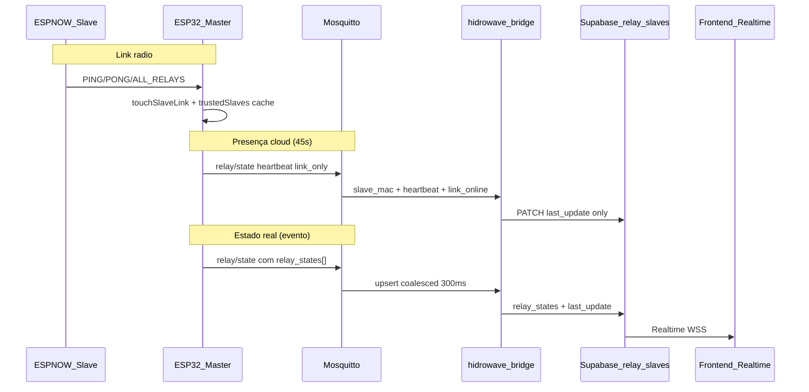
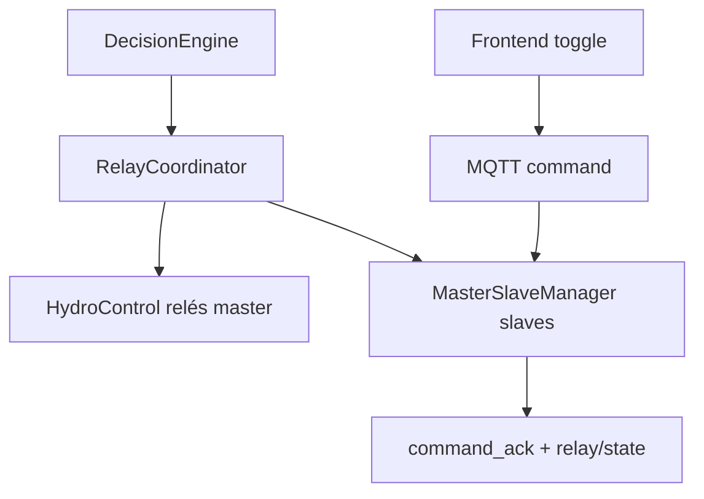

# Handoff — Slave Link + Realtime relay_states

**Data:** 23 jun 2026  
**Contexto:** Slave ESP-NOW `14:33:5C:38:BF:60` aparecia **Offline** na UI com 8 relés OFF, apesar do master reportar `online:1` no serial.  
**Dispositivos:** Master `ESP32_HIDRO_1A575C` · Slave `ESP32_SLAVE_14_33_5C_38_BF_60` · Bridge Lightsail `ubuntu@99.79.36.220`

---

## 1. Resumo executivo

| Camada | Estado antes | Estado após fix |
|--------|--------------|-----------------|
| ESP-NOW (master ↔ slave) | Slave offline ~100s, depois online ~250s | OK — PONG/ALL_RELAYS, cache `is_online:true` |
| MQTT master → broker | Heartbeat `relay/state` a cada ~45s | OK — payload novo com `heartbeat:true` |
| Bridge `hidrowave-bridge` | **Rejeitava** mensagens (código antigo em memória) | **OK** — `PATCH relay_slaves link-only` + upsert com estados |
| Supabase `relay_slaves` | `last_update` stale > 90s | Fresco após restart do serviço |
| Frontend HIDROWAVE | Offline + toggles desabilitados | Deve passar a Online após WSS/REST (reload) |

**Causa raiz:** desfasamento de deploy — `index.js` novo estava em disco no servidor, mas o processo Node (PID antigo) ainda executava validação antiga (`need master[] or slave_mac_address + relay_states[]` **sem** `or heartbeat`). Um `systemctl restart` após copiar o ficheiro desbloqueou o pipeline.

---

## 2. Sintoma vs evidência

### Serial master (firmware novo)

```
[SLAVE-LINK] event=relay_state_link_heartbeat mac=14:33:5C:38:BF:60 online=0
[MQTT] relay/state published
...
online:1, offline:0  (cache após ~250s)
[SLAVE-LINK] event=relay_state_link_heartbeat mac=14:33:5C:38:BF:60 online=1
```

### Bridge (antes do restart efectivo)

```
Rejected hidrowave/ESP32_HIDRO_1A575C/relay/state: need master[] or slave_mac_address + relay_states[]
```

### Bridge (após deploy + restart — 23 jun ~18:00 UTC)

```
[bridge] PATCH relay_slaves link-only ESP32_SLAVE_14_33_5C_38_BF_60 via MQTT
[bridge] PATCH relay_slaves ESP32_SLAVE_14_33_5C_38_BF_60 via MQTT
```

Sem linhas `Rejected` com mensagem antiga.

---

## 3. Arquitectura acordada (3 camadas)



| Fila / store | O que é | Não confundir com |
|--------------|---------|-------------------|
| `pendingRelayCommands` (RAM master) | Retry ESP-NOW + ACK 30s | Cola MQTT |
| `hidrowave/+/relay/state` | Telemetria de relés | `heartbeat` device_status |
| `relay_slaves` (Supabase) | Fonte UI (estados + presença) | Cache NVS local |

---

## 4. O que foi implementado (23 jun 2026)

### 4.1 Firmware — `ESP-HIDROWAVE-main`

| Ficheiro | Mudança | Porquê |
|----------|---------|--------|
| `HydroSystemCore.cpp` | Heartbeat MQTT **sem** `relay_states[]` (`omitRelayStates=true`) | Evitar pisar estados na cloud com cache stale → UI "Online + tudo OFF" |
| `HydroSystemCore.cpp` | `ALL_RELAYS` snapshot → `publishSlaveRelayStateMqtt(..., heartbeat=false)` | Sync completo à nuvem após hardware reportar 8 relés |
| `HydroSystemCore.cpp` | `readSlaveRelaySnapshot` em vez de ponteiro pós-mutex | Race: `getTrustedSlave()` libertava mutex antes do publish MQTT |
| `MasterSlaveManager.cpp` | `touchSlaveLink` + `requestSlaveStatus()` em `wasOffline` | Ao reconectar, pedir ALL_RELAYS e alimentar sync MQTT |
| `MasterSlaveManager.cpp` | `readSlaveRelaySnapshot()` | Leitura atómica sob `trustedSlavesMutex` |
| `MasterSlaveManager.cpp` | `logSlaveLink` — `String macBuf` antes de `printf` | Bug: `macToString().c_str()` temporário → log corrupto `mac=xV...` |
| `MasterSlaveManager.cpp` | `checkSlaveStatus` — timeout mutex 100ms, skip silencioso | Reduzir contensão e spam `mutex_timeout` |
| `MqttClient.cpp` | Campos `heartbeat`, `link_online`, `link_last_seen_s`, `omitRelayStates` | Contrato bridge/UI |
| `ESPNowController.cpp` | PONG/broadcast → `touchSlaveLink` | Histeresis online 60s / reachable 45s |

**Payload heartbeat (intencional):**

```json
{
  "v": 1,
  "device_id": "ESP32_HIDRO_1A575C",
  "slave_mac_address": "14:33:5C:38:BF:60",
  "link_online": true,
  "link_last_seen_s": 12,
  "heartbeat": true
}
```

**Payload estado completo (após toggle OK ou ALL_RELAYS):**

```json
{
  "slave_mac_address": "14:33:5C:38:BF:60",
  "relay_states": [0,1,0,0,0,0,0,0],
  "relay_has_timers": [...],
  "relay_remaining_times": [...],
  "link_online": true
}
```

### 4.2 Bridge — `infra/mqtt/bridge/index.js`

| Mudança | Porquê |
|---------|--------|
| `validateRelayState` aceita `slave_mac + heartbeat` sem `relay_states[]` | Heartbeat link-only |
| `patchRelaySlaveFromMqtt` — ramo `linkOnly` só actualiza `last_update` | Não resetar `relay_states` a `false` |
| Coalescing 300ms para upserts com estados | Ráfaga de toggles não perde último estado |
| Throttle heartbeat 45s (`RELAY_HEARTBEAT_THROTTLE_MS`) | Separado do throttle de mudanças de estado |
| Log `slave_link_gap` se gap > 90s | Diagnóstico presença |

### 4.3 Frontend — `HIDROWAVE-main`

| Ficheiro | Mudança | Porquê |
|----------|---------|--------|
| `slave-status.ts` | `SLAVE_ONLINE_THRESHOLD_MINUTES = 1.5` (90s) | Alinhado com heartbeat firmware |
| `slave-status.ts` | `resolveSlaveOnline` — `link_online` explícito prevalece | Quando coluna existir no row WSS |
| `relay-apply.ts` | Link-only não altera `relays[]` se `relay_states` ausente | PATCH heartbeat não apaga UI |
| `relay-apply.ts` | Normalização MAC | Match `14:33:5C:38:BF:60` vs variantes |
| `AutomacaoPageClient.tsx` | Toggle usa `slave.relays.state` salvo optimista | Uma fonte de verdade vs `relayStates` Map |

### 4.4 Ops / scripts

| Artefacto | Notas |
|-----------|-------|
| `scripts/deploy-lightsail.ps1` | SCP `index.js` + `check-relay-slave-row.js`; grep pós-deploy `link-only\|Rejected` |
| `scripts/check-relay-slave-row.js` | Convertido para ESM (`import`) — `package.json` tem `"type":"module"` |
| `hidrowave-bridge.service` | `WorkingDirectory=/opt/hidrowave-bridge` |

**Deploy efectivo (23 jun):**

```powershell
cd infra\mqtt\bridge\scripts
.\deploy-lightsail.ps1
# Se journalctl ainda mostrar Rejected com mensagem antiga:
ssh ubuntu@99.79.36.220 "sudo systemctl restart hidrowave-bridge"
```

---

## 5. Decisões de design

### 5.1 Dois tipos de mensagem `relay/state`

| Tipo | Quando | Efeito Supabase | Efeito UI |
|------|--------|-----------------|-----------|
| **Link heartbeat** | Cada 45s, slave conhecido | Só `last_update` | Badge **Online**; relés inalterados |
| **State sync** | Toggle ACK, ALL_RELAYS, reconexão | Upsert `relay_states[]` | Toggles reflectem hardware |

**Racional:** um único heartbeat com estados do cache master gerava `all-false` na cloud quando o cache estava desactualizado mas `last_update` fresco — pior que offline explícito.

### 5.2 Presença UI: `last_update` vs `link_online`

- Hoje o bridge **não** persiste `link_online` em `relay_slaves` no ramo link-only.
- O frontend usa `last_update` < 90s como proxy de online (`resolveSlaveOnline`).
- `link_online` no payload MQTT serve telemetria e futura coluna; WSS link-only não deve forçar offline se `link_online=false` estiver stale — já tratado em `relay-apply.ts` (só aplica estados se array presente).

### 5.3 Cola ESP-NOW vs cloud

- `nextRetry` com `waitingForAck=true` bloqueia reenvio até timeout ACK (30s).
- Comandos enviados com slave offline → `FAILED` Supabase (ex.: ID 308) — **esperado**; não bloqueia heartbeat.
- Gap mínimo entre envios ESP-NOW: 500ms (`MIN_ESPNOW_SEND_GAP_MS`).

### 5.4 Mutex `trustedSlavesMutex`

Invariante mantida: um `Give` por caminho. Melhorias 23 jun:

- Não logar `mutex_timeout` em `checkSlaveStatus` (fire-and-forget 100ms).
- Publish MQTT via snapshot copiado, não ponteiro ao vector.
- Correcção lifetime `String` em logs `[SLAVE-LINK]`.

---

## 6. Interlocks, DecisionEngine e schedules — estado actual e melhorias

### 6.1 O que já existe

| Componente | Papel |
|------------|-------|
| `DecisionEngine` | Regras locais LittleFS; `trigger_type`: `periodic`, `on_change`, `scheduled` |
| `checkSafetyConstraints` | Interlocks por regra (`safety_checks[]`) antes de `executeActions` |
| `DecisionEngineIntegration` | `SafetyInterlock` manager separado |
| `HydroControl` | `tankScriptHoldUntilMs` — pausa Auto EC/pH durante script de tanque |
| Mutex regra `ph_low_control` vs `auto_ph_active` | Evita conflito controlador pH |
| `HIDRO_DEV_RELAX_SENSORS` | Dev: desactiva interlocks de sensor |

Logs em produção: `📋 [REGRAS] Cloud sync desativado — DecisionEngine local ativo`.

### 6.2 Lacunas / riscos (não resolvidos nesta sessão)

1. **Regras que accionam relés slave** passam por `executeRelayAction` → master local; **não há** caminho unificado DecisionEngine → `MasterSlaveManager::sendRelayCommand` → MQTT ack → Supabase para slaves ESP-NOW.
2. **Schedules** (`trigger_type: scheduled`) — avaliar se cron está alinhado com timezone grow-cycle; sem teste E2E com slave offline.
3. **Interlock cruzado master/slave** — ex.: nível água baixo no master deve bloquear relés slave; hoje safety checks usam `SystemState` local, não `trustedSlaves[].isOnline`.
4. **SSL hot path** — `[SSL] defer EC/PH poll` pode atrasar loop e indiretamente mutex ESP-NOW sob carga.
5. **Parada de emergência** em `checkSafetyConstraints` — comentário "Implementar parada de emergência" ainda placeholder.

### 6.3 Melhorias recomendadas (roadmap)

#### P1 — Unificar actuadores na automação



- `RelayCoordinator` já existe — estender para **todas** as entradas (UI, regras, schedules) com mesma política de ACK e interlock.
- Regra com `target: slave` + `mac` → fila `pendingRelayCommands`, não GPIO directo.

#### P1 — Interlock matrix explícita

| Condição | Bloqueia | Prioridade |
|----------|----------|------------|
| `water_level == baixo` | Qualquer relé de irrigação slave | Crítico |
| `!slave.isOnline()` | Comandos para esse MAC | Alto |
| `auto_ph_active` | `ph_low_control` manual | Médio |
| `tankScriptHoldUntilMs` | Auto EC/pH | Médio |
| `hasInFlightForMac` | Novo comando mesmo relé | Baixo (serializar) |

Implementar em `RelayCoordinator::mayExecute(cmd)` antes de ESP-NOW **e** antes de aceitar MQTT command.

#### P2 — Schedules com janela e cooldown cloud-safe

- Persistir `last_execution` por `rule_id` em NVS.
- Schedules que afectam slave: só executar se `readSlaveRelaySnapshot` + `isSlaveReachable`.
- Expor na UI próxima execução (opcional Supabase `rule_runs`).

#### P2 — Observabilidade

- Correlacionar `[SLAVE-LINK] event=` com `command_id` Supabase no mesmo log line.
- Bridge: métrica contador `relay_state_rejected_total` vs `link_only_patch_total`.
- Frontend: log `[Realtime] relay_slaves row sin match` já existe em dev — activar em staging.

#### P3 — Coluna `link_online` em `relay_slaves`

- Migração SQL + bridge PATCH no ramo link-only.
- `resolveSlaveOnline` passa a usar campo persistido; reduz dependência só de `last_update`.

---

## 7. Checklist de aceitação E2E

| # | Verificação | Comando / onde | OK se |
|---|-------------|----------------|-------|
| 1 | Bridge aceita heartbeat | `journalctl -u hidrowave-bridge -f` | `PATCH relay_slaves link-only ESP32_SLAVE_14_33_5C_38_BF_60` ~45s |
| 2 | Sem rejeições antigas | journalctl | Ausência de `Rejected ... relay_states[]` (mensagem sem `or heartbeat`) |
| 3 | Supabase fresco | `SLAVE_MAC=14:33:5C:38:BF:60 node scripts/check-relay-slave-row.js` | `age_sec` < 90 |
| 4 | UI Online | Automacao → reload | Badge verde; controlos habilitados |
| 5 | Toggle relé 0 | UI + serial | ACK + `PATCH relay_slaves` com estados + UI < 2s |
| 6 | Estabilidade 2 min | Esperar sem toggles | Relés não voltam todos a OFF |
| 7 | Firmware flash | `platformio run -t upload` | Serial mostra `relay_state_link_heartbeat` + ALL_RELAYS sync |

---

## 8. Acções pendentes para o próximo turno

1. **Flash firmware** master com alterações 23 jun (ainda local / não confirmado em bancada).
2. **Redeploy frontend** HIDROWAVE se produção não tiver `slave-status.ts` / `relay-apply.ts` novos.
3. **Correr** `check-relay-slave-row.js` no servidor (script ESM corrigido).
4. **Testar toggle** com slave online — confirmar comando não FAILED.
5. **Validar Realtime** — consola browser: `[Realtime] relay_master/slaves SUBSCRIBED`; se `CHANNEL_ERROR`, correr `ENABLE_REALTIME_REPLICATION.sql` para `relay_slaves`.
6. **Roadmap interlocks** — desenhar PR `RelayCoordinator` + matriz §6.3 antes de activar schedules em slave.

---

## 9. Ficheiros de referência

| Área | Path |
|------|------|
| Slave link | `src/MasterSlaveManager.cpp`, `include/MasterSlaveManager.h` |
| MQTT publish | `src/HydroSystemCore.cpp`, `src/MqttClient.cpp` |
| Bridge | `infra/mqtt/bridge/index.js` |
| Deploy | `infra/mqtt/bridge/scripts/deploy-lightsail.ps1` |
| Diagnóstico DB | `infra/mqtt/bridge/scripts/check-relay-slave-row.js` |
| Frontend realtime | `HIDROWAVE-main/src/lib/realtime/relay-apply.ts`, `slave-status.ts` |
| Decision / interlock | `src/DecisionEngine.cpp`, `include/DecisionEngineIntegration.h`, `src/RelayCoordinator.cpp` |
| Handoff anterior ESP-NOW | `docs/handoffs/espnow/PRODUCTION_HANDOFF.md` |

---

## 10. Lições aprendidas

1. **`systemctl restart` ≠ deploy** — validar mensagem de erro no journal (texto da `reason` em `validateRelayState`) confirma versão em execução.
2. **Heartbeat com estados stale é pior que sem estados** — separar presença (`last_update`) de verdade física (`relay_states[]`).
3. **Ponteiros pós-mutex em ESP32 multi-task** — sempre copiar snapshot para stack antes de MQTT/Serial.
4. **UI offline com radio online** — quase sempre quebra na camada bridge→Supabase, não no ESP-NOW.

---

*Documento gerado na sessão de diagnóstico 23 jun 2026. Não editar o ficheiro de plano `.cursor/plans/` — este handoff é a fonte operacional.*
