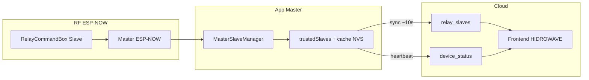

# ESP-NOW Produção — Handoff

Documento de referência para manutenção firmware ↔ Supabase ↔ frontend (HIDROWAVE).

## Arquitectura 3 camadas



| Camada | Responsabilidade |
|--------|------------------|
| RF | PING/PONG, DEVICE_INFO, ALL_RELAYS_STATUS |
| App Master | `trustedSlaves`, mutex, sync Supabase |
| Cloud | `relay_slaves.relay_states[8]`, presença online |
| Frontend | Badge + toggles via REST/WSS |

## Contratos de dados

| Campo | Regra |
|-------|-------|
| `device_id` slave | `ESP32_SLAVE_{MAC_underscores}` — ex: `ESP32_SLAVE_14_33_5C_38_BF_60` |
| Master actual | `ESP32_HIDRO_1A575C` (MAC `EC:E3:34:1A:57:5C`) |
| Online UI | `relay_slaves.last_update` < 5 min **ou** `device_status.last_seen` < 5 min |
| Estados | `relay_slaves.relay_states[8]` boolean array |
| Heartbeat slave | PATCH `device_status` após `relay_slaves` sync OK |

## Ficheiros tocáveis vs proibidos

**Tocar (produção ESP-NOW):**
- `src/MasterSlaveManager.cpp` — status 1×, mutex, discovery
- `src/ESPNowController.cpp` — ALL_RELAYS_STATUS, peers, logs
- `src/SupabaseClient.cpp` — `relay_slaves`, heartbeat, retry 409
- `src/HydroSystemCore.cpp` — defer sync se heap/SSL busy
- `include/MASTER_CONFIG.h` — `LOG_ESPNOW_*`, `DEBUG_ESPNOW`
- Frontend: `src/lib/esp32-api.ts`, `src/lib/realtime/relay-apply.ts`, `src/lib/realtime/slave-status.ts`

**Não tocar sem migração/plano:**
- Schema SQL (`relay_slaves`, FK `device_status`)
- `platformio.ini` flag `-D MASTER_MODE`
- Mutex Give antes de callbacks externos

## Invariantes

1. Todo `xSemaphoreTake(trustedSlavesMutex)` → exactamente um `xSemaphoreGive` por caminho.
2. Callbacks (`slaveDiscoveredCallback`, Supabase) **depois** de `Give`.
3. Object Pool HTTPS: sempre `release` após `acquire`.
4. `requestSlaveStatus()` envia **1** comando `status` (relé 0) → Slave responde `ALL_RELAYS_STATUS`.
5. `processingStatusResponse==true` → sem logs per-relay nem Supabase per-relay.

## Testes de aceitação

1. **Serial Master:** `[Cache] 1 slaves (online: 1)`; sem `TIMEOUT mutex`; < 20 linhas/min steady-state.
2. **Supabase:**
   ```sql
   SELECT device_id, relay_states, last_update FROM relay_slaves
   WHERE device_id = 'ESP32_SLAVE_14_33_5C_38_BF_60';
   SELECT device_id, is_online, last_seen FROM device_status
   WHERE device_id = 'ESP32_SLAVE_14_33_5C_38_BF_60';
   ```
   PATCH < 2 min; `relay_states` reflecte hardware; `last_seen` actualizado.
3. **Frontend:** Painel Master → tab Slaves → badge Online + relés correctos após refresh.
4. **SSL:** sem burst de 8× `Comando enviado: Relé N -> status` por sync.

## Prompt template para agentes IA

```
Contexto: ESP-HIDRO Master ESP32_HIDRO_1A575C, Slave MAC 14:33:5C:38:BF:60, canal 1.
ESP-NOW OK. Problema: Supabase SSL intermitente + frontend offline.
Alterar APENAS: [ficheiro]. Manter mutex Give antes de callbacks.
Testar: PATCH relay_slaves + device_status.last_seen + UI online.
```

## Reflash

| Fase | Dispositivo |
|------|-------------|
| Fase 1 (logs, Supabase, status 1×) | Só Master |
| Fase 2 (frontend) | Deploy Vercel / Next.js |
| Fase 3 (SSL serialize) | Master |
| Slave logs (opcional) | ESPNOW-SLAVE-TASK ou bridge legacy |

## Verificação manual pós-fix

1. SQL acima no Supabase Dashboard.
2. Frontend: `ESP32_HIDRO_1A575C` → Slaves → Atualizar.
3. Serial: contar linhas/min (target < 20).
4. Confirmar PATCH 200 sem flood status 8×.
