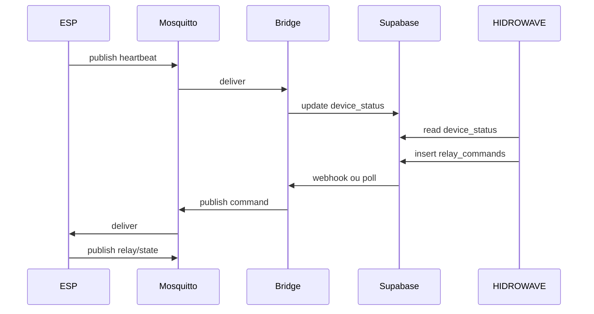

# 04 — Modelagem de tópicos, payloads e cuidados

Este documento é a referência para **não quebrar** compatibilidade entre ESP, broker, bridge e Supabase.

---

## 1. Hierarquia de tópicos

### Regra base

```
hidrowave/{device_id}/{recurso}
```

- **`hidrowave`**: namespace global do produto (evita colisão com outros clientes no mesmo broker).
- **`{device_id}`**: exatamente o mesmo string de `getDeviceID()` — ex. `ESP32_HIDRO_269844`.
- **`{recurso}`**: substantivo no singular, minúsculas, sem espaços.

### Proibido na modelagem

| Erro | Por quê |
|------|---------|
| Tópico sem `device_id` (`hidrowave/telemetry`) | Bridge não sabe qual linha atualizar |
| Espaços ou UTF-8 no path | Clientes e ACL frágeis |
| `device_id` diferente do Supabase | UI mostra device errado offline |
| Wildcard no publish do ESP (`hidrowave/#`) | Falha de segurança; ACL deve bloquear |
| Retain em telemetria de alta frequência | Broker guarda payload gigante/stale |

---

## 2. Tabela oficial de tópicos

| Tópico completo | Direção | QoS | Retain | Frequência | Consumidor |
|-----------------|---------|-----|--------|------------|------------|
| `.../heartbeat` | ESP → broker | 0 | false | 30 s | Bridge → `device_status` |
| `.../telemetry` | ESP → broker | 0 | false | 30–60 s | Bridge → `hydro_measurements` |
| `.../status` | ESP → broker | 1 | **true** | connect + LWT | Bridge → `is_online` |
| `.../relay/state` | ESP → broker | 1 | false | on change | Bridge opcional / debug |
| `.../command` | broker → ESP | 1 | false | sob demanda | ESP subscribe |
| `.../ec_operation` | ESP → broker | 0 | false | 12s activo / 30s idle | Bridge → `relay_master.ec_operation_*` |
| `.../dose` | ESP → broker | 1 | false | por nutriente | Bridge → `nutrient_dosages` |
| `.../ph_operation` | ESP → broker | 0 | false | 12s activo / 30s idle | Bridge → `relay_master.ph_operation_*` |
| `.../ph_dose` | ESP → broker | 1 | false | por corrección pH | Bridge → `ph_dosages` |

### Last Will and Testament (LWT)

Configurar no **CONNECT** do ESP:

- **Topic:** `hidrowave/{device_id}/status`
- **Payload:** `{"online":false,"ts":<unix>}`
- **QoS:** 1
- **Retain:** true

No connect bem-sucedido, publicar retain:

`{"online":true,"ts":<unix>,"fw":"2.1.0"}`

**Cuidado:** retain `online:true` de sessão antiga pode mentir até o primeiro publish — bridge deve cruzar com `heartbeat` recente.

---

## 3. Esquemas JSON (versão `v1`)

Todos os payloads devem incluir:

```json
{
  "v": 1,
  "device_id": "ESP32_HIDRO_269844",
  "ts": 1716490000
}
```

`ts` = Unix segundos (UTC). Bridge e Supabase usam ISO quando gravam.

### 3.1 Heartbeat → `.../heartbeat`

```json
{
  "v": 1,
  "device_id": "ESP32_HIDRO_269844",
  "ts": 1716490000,
  "online": true,
  "heap_free": 145000,
  "rssi": -62,
  "uptime_s": 3600
}
```

**Mapeamento Supabase (`device_status`):**

| Campo MQTT | Coluna | Nota |
|------------|--------|------|
| `ts` / recebimento | `last_seen` | `now()` no bridge |
| `online` | `is_online` | true se heartbeat &lt; 2 min |

### 3.2 Telemetria → `.../telemetry`

Alinhar com campos já enviados em `sendHydroData` / `environment_data`:

```json
{
  "v": 1,
  "device_id": "ESP32_HIDRO_269844",
  "ts": 1716490000,
  "ph": 6.2,
  "tds": 850,
  "water_temp": 24.5,
  "air_temp": 26.0,
  "humidity": 55.0,
  "water_level_ok": true
}
```

**Cuidados:**

- Não duplicar insert HTTPS e MQTT sem **throttle** no bridge (ex.: max 1 registro/min por device se ambos ativos na fase 2).
- Tipos numéricos: JSON number, não string `"6.2"`.
- Valores inválidos de sensor: omitir chave ou `null`, nunca `-999` sem documentar.

### 3.3 Comando → `.../command` (broker → ESP)

Espelhar semântica de `relay_commands`. **Fonte de verdade TypeScript:** `HIDROWAVE-main/src/lib/mqtt-relay-command-schema.ts`.

```json
{
  "v": 1,
  "id": 12345,
  "cmd": "relay",
  "device_id": "ESP32_HIDRO_269844",
  "relay_index": 0,
  "action": "on",
  "duration_s": 30,
  "source": "web",
  "command_type": "manual",
  "priority": 10,
  "triggered_by": "mqtt_push"
}
```

**Slave ESP-NOW** (master recebe MQTT, reenvia por radio):

```json
{
  "v": 1,
  "id": 12346,
  "cmd": "relay",
  "device_id": "ESP32_HIDRO_269844",
  "relay_index": 0,
  "action": "on",
  "duration_s": 0,
  "source": "web",
  "command_type": "manual",
  "priority": 10,
  "triggered_by": "mqtt_push",
  "target_device_id": "AA:BB:CC:DD:EE:FF",
  "slave_mac_address": "AA:BB:CC:DD:EE:FF"
}
```

| Campo | Obrigatório | Descrição |
|-------|-------------|-----------|
| `v` | sim | `1` — rejeitar outras versões |
| `id` | sim | `relay_commands.id` (> 0) — dedup NVS |
| `cmd` | sim | `relay` (futuro: `reboot`, `ec_stop`) |
| `device_id` | sim | Master `ESP32_HIDRO_XXXXXX` (validação regex) |
| `relay_index` | sim | Master 0–15, slave 0–7 |
| `action` | sim | `on` / `off` (não defaultar) |
| `duration_s` | sim | `0` se sem timer; peristáltica > 0 |
| `source` | sim | `web` \| `api` \| `rule` |
| `command_type` | sim | `manual` \| `rule` \| `peristaltic` |
| `priority` | sim | 0–100 (default: manual=10, rule=50, peristáltica=80) |
| `triggered_by` | não | ex. `mqtt_push`, `web_interface` |
| `target_device_id` | slave | MAC `AA:BB:CC:DD:EE:FF` |
| `slave_mac_address` | slave | Alias de `target_device_id` |
| `rule_id` / `rule_name` | não | Automação |

**Cuidados:**

- ESP deve **idempotência**: mesmo `id` duas vezes não deve pulsar relé duas vezes.
- Comando sem `id` = rejeitar (log only).
- Tamanho máximo payload MQTT no ESP: buffer **512 bytes** (PubSubClient) — manter JSON &lt; 400 bytes.

### 3.4 Estado relés → `.../relay/state`

```json
{
  "v": 1,
  "device_id": "ESP32_HIDRO_269844",
  "ts": 1716490000,
  "master": [0,1,0,0,0,0,0,0],
  "slaves": {}
}
```

Publicar **somente quando mudar** (após comando local, ESP-NOW ou remoto).

**Cuidado:** não substituir ainda `relay_master` no Supabase sem política clara — na fase 2–3 MQTT é espelho; Supabase continua autoritativo para UI.

### 3.5 Estado Auto EC → `.../ec_operation`

```json
{
  "v": 1,
  "device_id": "ESP32_HIDRO_269844",
  "ec_operation_state": "recirculating",
  "ec_operation_remaining_sec": 60,
  "ec_next_check_in_sec": 0
}
```

**Mapeamento Supabase (`relay_master`):** `ec_operation_state`, `ec_operation_remaining_sec`, `ec_next_check_in_sec`.

Estados válidos: `idle`, `dosing`, `waiting_nutrient`, `recirculating`, `ec_check_pending`.

### 3.6 Dosagem EC → `.../dose`

```json
{
  "v": 1,
  "device_id": "ESP32_HIDRO_269844",
  "sequence_id": "abc123",
  "nutrient_name": "22CCC",
  "relay_number": 3,
  "dosage_ml": 10.5,
  "dosage_time_seconds": 5.0,
  "ec_before": 850.0,
  "ec_setpoint": 1200.0,
  "source": "auto_ec"
}
```

**Mapeamento Supabase (`nutrient_dosages`):** INSERT completo. `relay_number` **0-based** (relé 4 → `3`).

### 3.7 Estado Auto pH → `.../ph_operation`

```json
{
  "v": 1,
  "device_id": "ESP32_HIDRO_269844",
  "ph_operation_state": "recirculating",
  "ph_operation_remaining_sec": 45,
  "ph_next_check_in_sec": 0
}
```

**Mapeamento Supabase (`relay_master`):** `ph_operation_state`, `ph_operation_remaining_sec`, `ph_next_check_in_sec`.

Estados válidos: `idle`, `dosing`, `recirculating`, `ph_check_pending`.

Heartbeat firmware: 12s durante ciclo activo; 30s en `idle` (limpia estados huérfanos).

### 3.8 Dosagem pH → `.../ph_dose`

```json
{
  "v": 1,
  "device_id": "ESP32_HIDRO_269844",
  "sequence_id": "1716490123",
  "direction": "up",
  "relay_number": 1,
  "dosage_ml": 2.5,
  "dosage_time_seconds": 3.0,
  "ph_before": 5.8,
  "ph_setpoint": 6.0,
  "source": "auto_ph"
}
```

**Mapeamento Supabase (`ph_dosages`):** INSERT completo. `direction`: `up` (pH+) o `down` (pH−/ácido). `relay_number` **0-based**.

**Nota:** tópico separado de `dose` (EC) — payloads distintos; no mezclar en un solo handler.

---

## 4. QoS e semântica de entrega

| QoS | Uso no HIDROWAVE |
|-----|------------------|
| 0 | heartbeat, telemetry, ec_operation, ph_operation (perda aceitável; próximo ciclo corrige) |
| 1 | status, command, relay/state, dose, ph_dose (entrega pelo menos uma vez) |
| 2 | **não usar** no ESP (overhead e pouco suporte) |

**Duplicata QoS 1:** bridge e ESP devem tolerar mesma mensagem duas vezes (idempotência por `id` ou `ts`).

---

## 5. Sincronização de relógio

- ESP: `time()` após NTP; se inválido, enviar `ts: 0` e bridge usa hora de recebimento.
- Nunca confiar só no `ts` do payload para **segurança** — só para ordenação de telemetria.

---

## 6. Versionamento (`v` field)

| Versão | Mudança |
|--------|---------|
| 1 | Esquemas deste documento |
| 2+ | Adicionar campos opcionais; nunca renomear sem período de dual-write |

Bridge deve ignorar mensagens com `"v": 99` desconhecida (log warning).

---

## 7. ACL Mosquitto (modelo por device)

Template em `infra/mqtt/mosquitto/acl.example`.

```
user mqtt_ESP32_HIDRO_269844
topic read  hidrowave/ESP32_HIDRO_269844/command
topic write hidrowave/ESP32_HIDRO_269844/#
```

User `bridge_internal`:

```
topic read hidrowave/+/heartbeat
topic read hidrowave/+/telemetry
topic read hidrowave/+/status
topic read hidrowave/+/relay/state
topic write hidrowave/+/command
```

---

## 8. Anti-padrões (modelagem)

1. **Um tópico JSON gigante** com tudo — dificulta throttle e ACL.
2. **Comandos no mesmo tópico da telemetria** — subscribe acidental perigoso.
3. **Retain em heartbeat 30 s** — último valor falso por horas.
4. **device_id só no tópico, não no JSON** — bridge ainda deve validar igualdade.
5. **Float sem arredondar** — preferir 1 casa decimal no JSON para tamanho.
6. **Slaves ESP-NOW dentro de telemetry sem limite** — payload estoura 512 B.

---

## 9. Alinhamento com tabelas Supabase

| MQTT | Tabela Supabase | Operação bridge |
|------|-----------------|-----------------|
| heartbeat | `device_status` | PATCH `last_seen`, `is_online` |
| status (LWT) | `device_status` | PATCH `is_online=false` |
| telemetry | `hydro_measurements` | INSERT |
| — | `relay_commands` | Não apagar; MQTT é entrega rápida |
| relay/state | `relay_master` / slaves | Opcional PATCH (fase 4+) |

Colunas exatas devem ser conferidas no schema atual antes do bridge em produção.

---

## 10. Diagrama de fluxo de mensagens



---

## 11. Checklist antes de codar payloads

- [ ] `device_id` no tópico = no JSON = Supabase
- [ ] Campo `v` presente
- [ ] Payload &lt; 400 bytes (comando e heartbeat)
- [ ] LWT testado (desenergizar ESP)
- [ ] Throttle bridge se HTTPS paralelo
- [ ] ACL testada com segundo device fake
