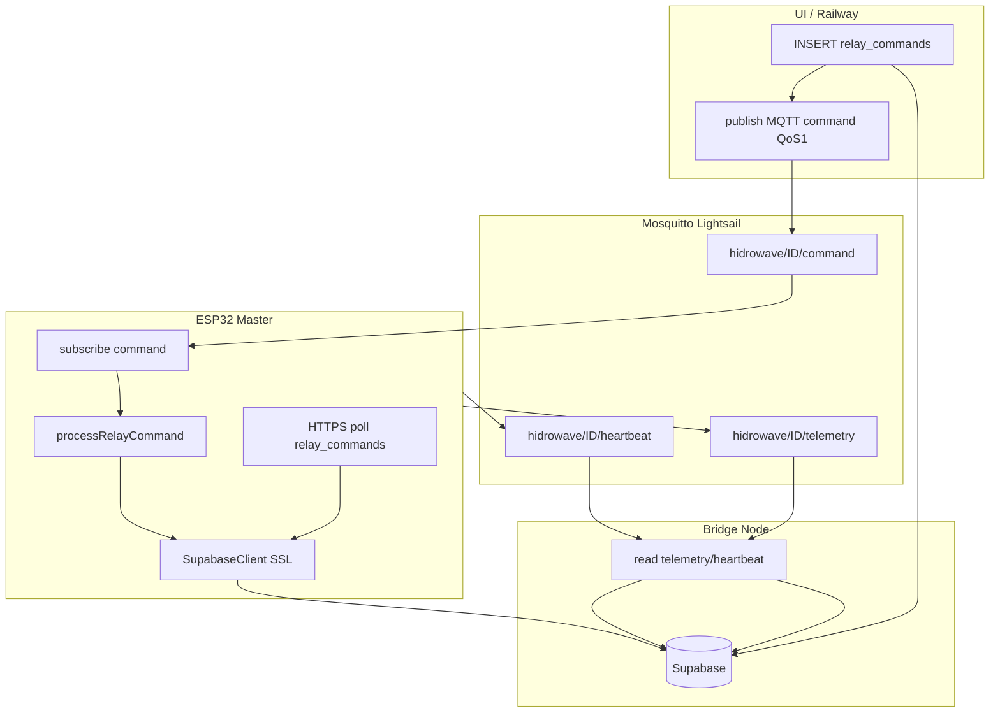

# Handoff — Fase 3: comandos híbridos MQTT + HTTPS

**Fecha bancada:** jun/2026 · **Device:** `ESP32_HIDRO_269844`  
**Estado:** Fase 3 **master local validada** en serial. Slave ESP-NOW y Railway publish pendientes operativos.

---

## 1. ¿Qué demostró la bancada? (representativo de Fase 3)

Serial confirmado:

```
[MQTT] rx command topic=hidrowave/ESP32_HIDRO_269844/command len=64
[CMD mqtt] id=910001 master R6 off dur=0s pri=50 tgt=local
🏠 [MASTER] Processando comando local
✅ Comando local executado com sucesso
✅ [MASTER] relay_master atualizado (relé 6 = off)
```

| Capa | Estado |
|------|--------|
| Broker Mosquitto (Lightsail) | OK — `mosquitto_sub` recibe |
| ESP subscribe `.../command` QoS1 | OK — tras flash Fase 3 |
| Parser v1 + dedup por `id` | OK |
| Ejecución master local | OK (software; relé físico = protoboard) |
| Ack Supabase `relay_master` | OK |
| Push desde Railway/UI | Pendiente env `MQTT_*` en prod |
| Comandos slave ESP-NOW | Bloqueado — `masterManager é nullptr` |

**Conclusión:** el **camino crítico Fase 3 master** está concretizado. No es soak 24h ni KPI formal, pero es evidencia representativa end-to-end MQTT → firmware → Supabase.

---

## 2. Arquitectura híbrida — qué va por MQTT vs qué queda en REST



### Tabla maestra — dirección y fallback

| Dato / acción | Canal primario | Canal backup | Si MQTT falla |
|---------------|----------------|--------------|---------------|
| **Comando relé (UI)** | MQTT push → ESP | HTTPS poll `relay_commands` 60s (online) / **10s** (offline) | INSERT en Supabase siempre; ESP recoge por RPC |
| **Telemetría sensores** | MQTT → bridge → Supabase | HTTPS `sendHydroData` si `mqtt_hydro_only=0` | Sigue HTTPS según `secrets.ini` |
| **Heartbeat / online** | MQTT → bridge → `device_status` | HTTPS `device_status` periódico | UI puede usar `last_seen` REST |
| **Estado relés UI** | Supabase `relay_master` / Realtime WSS | Sync HTTPS cada 10s (`RELAY_STATES_SYNC`) | Sin cambio — no pasa por MQTT |
| **EC config / Auto EC** | HTTPS RPC `activate_auto_ec` | NVS local | **No usa MQTT** — loop local `checkAutoEC()` |
| **Reglas automação** | HTTPS poll `decision_rules` 30s | — | Sin MQTT hoy |
| **Slave relé** | MQTT → master → **ESP-NOW** | HTTPS poll + ESP-NOW retry | Requiere `masterManager` activo |

### Flujo comando — éxito vs fallback

**MQTT OK (camino feliz, &lt;2 s objetivo):**

1. UI/API → `INSERT relay_commands` (`pending`)
2. API → `publish` `hidrowave/{master}/command` (JSON v1, `id` = fila Supabase)
3. ESP → `[CMD mqtt]` → ejecuta relé → `markCommandSent` / `completed` vía HTTPS
4. UI → Realtime o poll ve estado actualizado

**MQTT falla (Railway sin creds, broker caído, ACL):**

1. `INSERT relay_commands` **igual** (auditoría intacta)
2. `notifyDeviceRelayCommand` → skip silencioso o warn en logs Railway
3. ESP detecta MQTT down → poll **10 s** (`COMMAND_POLL_INTERVAL_MQTT_DOWN_MS`)
4. RPC `get_and_lock_master_commands` / slave → mismo `processRelayCommand(via=https)`

**Dedup:** mismo `id` por MQTT no repite (`MqttCommandDedup` NVS ~32 ids). HTTPS usa lock RPC.

---

## 3. Schema MQTT command v1 (alineado firmware ↔ frontend)

**Fuente TypeScript:** `HIDROWAVE-main/src/lib/mqtt-relay-command-schema.ts`  
**Parser firmware:** `src/MqttCommandParser.cpp`

### Master local

```json
{
  "v": 1,
  "id": 910001,
  "cmd": "relay",
  "device_id": "ESP32_HIDRO_269844",
  "relay_index": 6,
  "action": "on",
  "duration_s": 0,
  "source": "web",
  "command_type": "manual",
  "priority": 10,
  "triggered_by": "mqtt_push"
}
```

### Slave (mismo tópico del **master**, MAC en payload)

```json
{
  "v": 1,
  "id": 910010,
  "cmd": "relay",
  "device_id": "ESP32_HIDRO_269844",
  "relay_index": 0,
  "action": "on",
  "duration_s": 0,
  "target_device_id": "AA:BB:CC:DD:EE:FF",
  "slave_mac_address": "AA:BB:CC:DD:EE:FF",
  "command_type": "manual",
  "priority": 10
}
```

**Test manual Lightsail:**

```bash
mosquitto_pub -h 127.0.0.1 -p 1883 -u hidrowave -P '***' \
  -t 'hidrowave/ESP32_HIDRO_269844/command' \
  -m '{"v":1,"id":910001,"cmd":"relay","device_id":"ESP32_HIDRO_269844","relay_index":6,"action":"off","duration_s":0,"source":"web","command_type":"manual","priority":10}' -q 1
```

---

## 4. Memoria heap — bancada y límites del proyecto

### Lecturas observadas (serial)

| Momento | Heap libre | % uso ~320KB | Nota |
|---------|------------|--------------|------|
| Reposo / loop normal | ~137 KB | ~45% | Saludable |
| Tras comando MQTT + PATCH Supabase | ~97 KB | ~32% | Pico SSL; recupera |
| Heartbeat MQTT reportado | ~135 KB | ~42% | Estable |

### Umbrales firmware (`HydroSystemCore.h`)

| Constante | Valor | Efecto |
|-----------|-------|--------|
| `MIN_HEAP_FOR_HTTPS` | 30 KB | Debajo: no abre SSL Supabase |
| Alerta crítica | 15 KB | Log `ALERTA: Heap crítico` |
| Emergency | 8 KB | Medidas agresivas |
| Cache skip | 50 KB | Salta refresh cache slaves |

**Veredicto para crecimiento:** ~137 KB en reposo con MQTT + HTTPS + Auto EC activo es **aceptable** dentro de los límites predeterminados (margen ~100 KB sobre mínimo SSL). Picos a ~97 KB durante ack post-comando son **normales** en ESP32 con SSL; monitorizar en soak 24h. Riesgo futuro: más tareas SSL concurrentes, WebServerTask, muchos slaves — Fase 2b/4 reducen REST/h y alivian presión.

**MQTT footprint:** PubSubClient buffer 512 B; un contexto WiFi TCP — modesto vs HTTPS.

---

## 5. Infra Lightsail (recordatorio)

| Componente | Rol Fase 3 |
|------------|------------|
| Mosquitto `:1883` | Hub — mismo listener telemetría y comandos |
| User `hidrowave` | ESP: read `command`, write `device/#` |
| Bridge Node | **Solo** telemetry/heartbeat/status — **no** comandos |
| Railway `MQTT_*` | Publish a `.../command` tras INSERT |

ACL actual (VM): `bridge_internal` read telemetría; `hidrowave` read command + write device namespace.

---

## 6. Pendientes antes de “Fase 3 cerrada” en prod

- [ ] Railway: `MQTT_HOST`, `MQTT_PUBLISH_USER`, `MQTT_PUBLISH_PASS`
- [ ] Deploy frontend con `mqtt-relay-command-schema.ts`
- [ ] Fix init `masterManager` antes de `HydroSystemCore::begin()` (slave)
- [ ] Slave ESP-NOW online + test MQTT→ESP-NOW
- [ ] KPI: 100 comandos manuales, 0 dup, latencia MQTT &lt;2 s
- [ ] Desactivar Auto EC en bancada si EC=0 falsea dosagem (relés 4/6 ~863 s)
- [ ] Fase 2b: reducir REST sync si soak MQTT estable

---

## 7. Archivos clave tocados Fase 3

| Área | Archivos |
|------|----------|
| Firmware MQTT | `MqttClient.*`, `MqttCommandParser.*`, `MqttCommandDedup.*`, `CommandSerial.*`, `HydroSystemCore.cpp`, `Config.h` |
| Frontend publish | `mqtt-relay-command-schema.ts`, `mqtt-command-publish.ts`, APIs `relay-commands/*`, `esp-now/command`, `decision-rules-executor.ts` |
| Docs | `04_MODELAGEM_TOPICOS_PAYLOADS.md` §3.3, este handoff |

---

## 8. Una frase para el siguiente dev

**Supabase siempre tiene la verdad del comando; MQTT es el empujón rápido; HTTPS poll es la red de seguridad; telemetría y heartbeat van por MQTT al bridge, no al ESP vía UI.**
